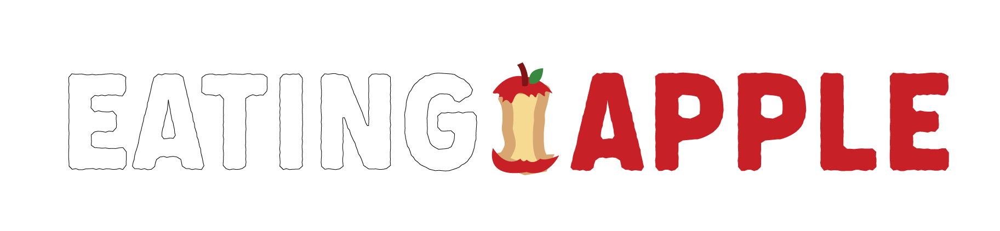

## 사소한 사과 웹사이트

## 👥 팀원 및 업무 분담

- **조상천**: 개발세팅, DB 작성 및 수정, 영화 관련 정보 백/프론트 구현
  - Github: https://github.com/highsky134
- **권상지**:  사용자 서버코드 작성, 마이페이지, 리뷰 수정,삭제, 관심있는 영화목록 
  - Github: https://github.com/qwr133
- **조성훈**: 로그인, 회원가입, 정보수정 CSS, HTML ,db자료조사 및 등록
  - Github: https://github.com/nuhgnoesoj
- **최재경**: 전반적인 HTML, CSS 작성, 파일 업로드, 세션, 인터셉터, 관리자 권한, 그 외 서포트
  - Github: https://github.com/Bcacao
 

## 📆 개발 계획

- 진행 기간: 2023.05.08 ~ 2023.05.26
- 웹사이트 이름: 사소한 사과
- 목표: 영화에 대한 정보(평점)를 한번에 확인할 수 있는 웹 사이트
        사용자들의 리뷰 데이터를 활용하여 영화에 대한 평점을 제공
        사용자들은 영화검색, 평점등록, 리뷰작성, 관심영화목록 등록 등의 기능을 통해 사이트 활용 가능

## 📒 Tech Log

- 기획 + 개발 세팅 + 모델링 + 로그인/회원가입/회원수정 페이지 + 메인 페이지 + 마이페이지</a>
- DB 수정 + Review 작성/ 수정 / 삭제 모달 + Review List 페이지 </a>
- DB 적용 + 평점을 기반으로 추천영화 리스트 페이지</a>
- 개별 영화 상세 페이지 + 평점 추가 + 관심 영화 등록 추가</a>
- Footer/Header 추가 + 폰트 추가 + Pagination 적용 </a>

 

## 🔧 Tech Stack

- **Front-end** : HTML, CSS, JS
  
- **Back-end** : SpringBoot, MariaDB
  

 

